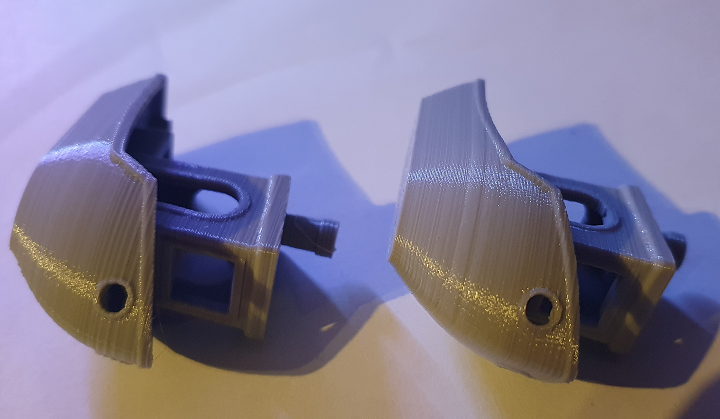
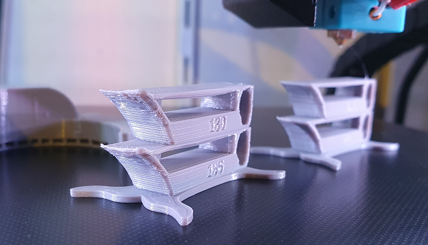
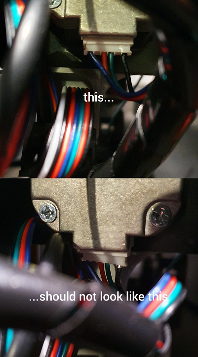

# 3d printing
## my cheat sheet

initial steps

* ensure orthograde cartesian coordinate system
* tighten screws
* [calibrate e-steps and temperature](https://3dprintbeginner.com/extruder-calibration-guide/)
* [level bed](https://all3dp.com/2/3d-printer-bed-leveling-step-by-step-tutorial/)
* find a slicer you're comfortable with. one slicer might be more suitable for particularly your machine than another (cura for mine as opposed to prusa) - at least out of the box, as it might be totally possible that settings can be adapted 

use the [refined calibration calculators](refined%20calculators.html), <s>stolen</s> refined from other sites.

toolbox

* spatula
* caliper
* tweezer
* long nose pliers
* scalpel or cutter
* ptfe grease (use sparingly)
* brass brush
* infrared thermometer to check bed temperature
* high percentage isopropyl alcohol
* lint free cloths

benchmarks

* [calicat](https://www.thingiverse.com/thing:1545913/files)
* [xyz cube](https://www.thingiverse.com/thing:1278865)
* [20mm test cube](https://www.thingiverse.com/thing:38108) without top and bottom, only one or two walls to check flow
* [bed level test](https://www.thingiverse.com/thing:34558)
* [temp tower](https://www.thingiverse.com/thing:2729076)

recommendations

hardware:
* spoolholder with decent bearings - avoid top mounted spool holder resulting in built up vibrations

slicer settings:
* walls from inside to outside to enhance connection especially on overhangs and concave curves
* infill with cubic subdivision - quick and stable at lower infill rate
* disable z-hop to enhance precision and spare z-axis mechanics
* enabled combing (relevant cut in print time!)
* reduce first layer dimension to avoid elephants foot

the upgrade trap

successful upgrades:
* mosfets for hotend and heatbed
* led illumination to examine quality during runtime
* cable chains ([support](https://www.thingiverse.com/thing:4335239))
* [bed holder](https://www.thingiverse.com/thing:3573378) 
* screw direction reminder for bed levelling
* a marvellous faceplate
* [bowden clips](https://www.thingiverse.com/thing:936611)

unsuccessful upgrades:
* heat bed insulation - confusing the thermistor
* any printed fan duct - tested multiple types and times, worse cooling on overhangs and fine edges as opposed to stock fan duct on [temp tower](https://www.thingiverse.com/thing:2729076) 

software:
* newer slicer versions might make use of commands older printer firmwares are not able to compute

remember

* no cold pull to avoid nozzle clogging
* heat up hotend and heatbed for levelling, hotend for nozzle changes
* the ptfe-tube must connect straight to the heatsink to avoid backflow
* slicer profiles should have some version control, too much meddling can make things worse
* belts can be too tight
* bowden extruders need more retract that direct extruders
* stepper motors have magic numbers, often a multiple of 0.04mm for layer heights
* unless you successfully installed a fan duct with an even flow, the direction of the model on the buildplate impacts the quality of the cooling effect and therefore layer quality and sometimes horizontal warping of thin structures

relax

* [troubleshooting guide](https://www.simplify3d.com/support/print-quality-troubleshooting/)
* expensive dry boxes may be overrated (for pla) [source](https://www.youtube.com/watch?v=5CFxT1q6dX8)
* be patient - lower speeds reward with better quality
* you have to live with bad bottom layers on rafts and support
* remember the technical boundaries of fdm prints - speed, resolution, anisotrophy
* be aware you most likely have a low budget machine - don't expect miracles

solved issues so far

### ringing noise on x-axis movement
loose x-stop case. superglue for peace of mind

### filament sensor false alert
at least on an anycubic mega you can just unplug it. no more false alerts. yes, you regain the risk of running out of filament midprint.

### sudden decrease in layer consistency
sometimes it's just the filament being shit -  all printed with identical settings consecutively

### sd card can not be read
small plastic parts broke off and clogged the card reader. cleaned and used another card

### sudden rattling noises on one of the z-axis stepper motors, x-tilt, prints failing
connection issue. for some reason the cable connector had other plans. pushed everything back together. it's not always a broken motor or driver.

 

disclaimer

* i am a beginner
* my first printer is a second grade anycubic i3 mega s

